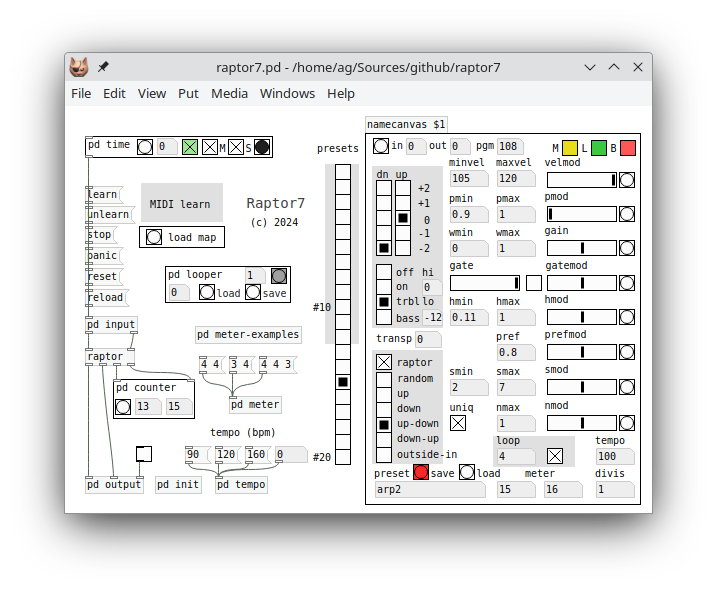
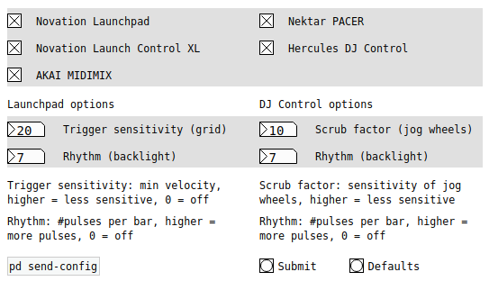
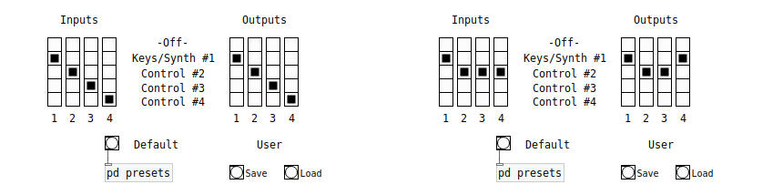

# Raptor: The Random Arpeggiator

Albert Gräf [\<aggraef@gmail.com\>](mailto:aggraef@gmail.com), March 2024  
Computer Music Dept., Institute of Art History and Musicology  
Johannes Gutenberg University (JGU) Mainz, Germany  
This document is licensed under [CC BY-SA 4.0](https://creativecommons.org/licenses/by-sa/4.0/).

**In memory of Clarence Barlow** (27 December 1945 – 29 June 2023).

## Introduction

This is version 7 of the Raptor patch, an experimental arpeggiator program based on the mathematical music theories of composer and computer music pioneer extraordinaire Clarence Barlow. This version is a backport of the [Ardour plugin](https://github.com/agraef/ardour-lua) included in [Ardour version 8](https://ardour.org/news/8.1.html) and later, which in turn was based on the original Lua version of Raptor (version 6). The present version is compatible with the Ardour plugin in terms of the underlying arpeggiator core (written in Lua), as well as the parameters and factory presets. While it is ultimately based on [Raptor 6](https://github.com/agraef/ardour-lua), the patch was completely rewritten to provide an improved and simplified interface, and also offers some important new features, such as latch mode, improved transport and looper functions, a MIDI learn facility, and much improved built-in support for a bunch of popular MIDI controllers. Here's Raptor running in [Purr Data][]:

Raptor is quite advanced as arpeggiators go, it's really a full-blown algorithmic composition tool, although it offers the usual run-of-the-mill deterministic and random arpeggios as well. The algorithmic part is engaged when you turn on the `raptor` toggle in the panel on the right. The algorithm behind Raptor is briefly sketched out in my [ICMC 2006 paper][] (cf. Section 8), but if you'd *really* like to understand what's going on there, I'm afraid that you'll have dive into Barlow's article in the [Ratio book][] and Raptor's source code. However, for starters you can just try some of the presets by clicking on the vertical strip of radio buttons to the left of the panel, and begin twiddling the parameters in the panel to find out what they do.

Using the patch is easy enough, but please check *Using Raptor* below for further information. In a nutshell, you open raptor7.pd in Pd, hook up your MIDI keyboard and synthesizer to Pd's first MIDI input and output, respectively, choose a preset, press the green playback toggle in the time subpatch, and start playing chords. Note that Raptor only generates MIDI data, so you need some sound-generating device to make music with it. But it works just fine with a free software synth such as [Qsynth][]. Of course, Raptor can also be used with a DAW or outboard gear such as a hardware synth or a groovebox, and can be synced to those by sending MIDI clocks to its MIDI input. We discuss all this in more detail in the following sections.

## Getting Started

Raptor will run in any modern flavor of Pd. It has been tested with Miller Puckette's "vanilla" [Pd][], Jonathan Wilkes' [Purr Data][], and Timothy Schoen's [plugdata][]. The only additional requirement is that you'll need [pd-lua][] to run it. Both Purr Data and plugdata come with a recent version of pd-lua included and enabled by default. For vanilla, you can get pd-lua from [Deken][], and you then still need to add `pdlua` to your startup libraries.

There is no real installation process, just download the latest Raptor release from [GitHub](https://github.com/agraef/raptor7) and unpack it, or clone the current git source. If Pd has been set up properly, double-clicking the raptor7.pd file (or running something like `pd raptor7.pd` from the command line on Linux) should open the patch in Pd. If that gives you a bunch of error messages in the Pd console window, then you probably still need to install pd-lua and enable it in your startup libraries.

The raptor7.pd patch can be invoked by itself, or as a subpatch in another main patch, also called an *ensemble* patch. In the latter case, you can optionally specify the name of an "autostart" preset to be recalled on startup as an argument (see the raptors.pd ensemble patch included in the distribution for an example). Note that in this case all embedded Raptor instances will keep running until you close the main ensemble patch. Closing the subpatch windows by themselves just removes them from the screen; the Raptor instances still keep running in the background.

## The Arpeggiator

Raptor is really an algorithmic composition program driven by note input. It keeps track of the chords you play like any arpeggiator, but the note output it generates is in general much more varied than just playing back the input notes in a given pattern. This functionality is available with the `raptor` control. If it is disabled, Raptor will still apply some basic parameters to the velocities and note filters, and produce a traditional arpeggio from the notes you play. If it is enabled, however, Raptor will pick notes more or less at random from a set of *candidate notes* determined by various harmonic criteria. Depending on the parameter settings, the generated notes may be close to the input, or at least harmonically related, or they may be entirely different, so the output can change from tonal to atonal and even anti-tonal in a continuous way. Moreover, Raptor can also vary the tonal strength automatically for each step based on the corresponding pulse weights.

Raptor's note generation process is quite involved, but at the heart of it there are just two basic "[musiquantical](http://clarlow.org/wp-content/uploads/2016/10/On-MusiquanticsA4.pdf)" notions and corresponding measures from Barlow's theories: *meter* (which determines a kind of one-to-one pulse weights called *indispensabilities*) and *harmonicity* (a measure for the consonance of intervals calculated from so-called *indigestibilities*). In fact, there are a lot of similarities between Raptor and Barlow's famous [Autobusk][] program which is based on the same concepts. Both programs can operate in real-time, but Autobusk is driven exclusively by parameter input and will happily produce a constant stream of notes as soon as you turn it on. In contrast, Raptor never becomes "creative" on its own, it *always* requires note input, otherwise it will just sit there twiddling its thumbs.

Thus, in Raptor harmonicities are used to *filter* candidate notes in relation to its note input (the notes you play). In other words, they determine *what* to play. On the other hand, the pulse weights are used to *assign* various parameters to each step in the pattern, such as note velocities and probabilities, and gate values. That is, they determine *how* to play the notes picked by the filter. The arpeggiator orchestrates the entire process, by taking note input from the musician, feeding the required data to the various parts of the algorithm in each step, and playing back the resulting stream of notes.

One rather unusual feature of Raptor's algorithm is the way that the Barlow indispensabilities drive the entire process by modulating various other parameters. Like in Autobusk, the pulse strengths affect note velocity and probability, but in Raptor they also modulate harmonicity and thereby change the note selection process itself. Another unique feature of the algorithm is the harmonic preference parameter, which lets you prioritize notes by harmonicity, and can also be modulated by pulse strength in an automatic fashion.

In the following we give an overview of the controls available in the panel on the right-hand side of the main patch. Raptor includes various factory presets for illustration purposes which you can use as a starting point for your own presets. (NOTE: As distributed, the program numbers in the factory presets assume a synthesizer with a General MIDI sound bank. If you frequently use non-GM synths then you may have to change these.)

Ranges are given in parentheses. Switches are denoted 0/1 (off/on). Continuous values use the 0 - 1 or -1 - +1 range and can be arbitrary floating point values. These generally denote probabilities or other normalized values (such as indispensabilities, harmonicities, and modulation values) expressed as fractions; some of these (in particular, the modulation parameters) can also be negative to reverse polarity. Other ranges denote integer values, such as MIDI channel and program numbers, MIDI note offsets, or enumerations such as the pattern and pitch tracker modes.

### MIDI Controls

These controls let you change the MIDI program and the MIDI channels for input and output. There's also an option for transposing note output.

- pgm (0-128): Sets the MIDI program (instrument sound) of a connected synthesizer. pgm = 0 (the default) means no change, otherwise a MIDI program change message is sent to the output channel.
- inchan, outchan (0-16): Sets the MIDI input and output channels. inchan = 0 (omni) means that notes on all channels will be received. outchan = 0 means that output goes to the input channel; otherwise it goes to the given MIDI channel. The default is inchan = outchan = 0, which means that MIDI input will be received on all channels and output goes to the last channel on which input was received.
- transp (-64 - 64): Transposes the output of the arpeggiator by the given number of semitones.

### Arpeggiator Modes

These controls are 0/1 switches which control various global modes of the arpeggiator.

- bypass (0/1): This mode, when engaged, suspends the arpeggiator and passes through its input as is. This provides a means to monitor the input to the arpeggiator, but can also be used as a tool for live performance.
- latch (0/1): In latch mode, the arpeggiator keeps playing if you release the keys on your MIDI keyboard. This is there to help imprecise players (like me) who tend to miss beats in chord changes, and makes playing the arpeggiator much easier.
- mute (0/1): This control suppresses note output of the arpeggiator (the arpeggiator still keeps tracking input notes, so that it is ready to go immediately when you unmute it again).
- raptor (0/1): Toggles raptor mode, which enables the advanced raptor controls discussed below.
- loop (0/1), loopsize (0-16): This engages Raptor's built-in looper which repeats the last few bars of output from the arpeggiator. The loopsize control specifies the number of bars to loop. If input runs short then the looper will use what it has, but it needs at least one complete bar to commence loop playback. (Also check the Looper section below for more information.)

### Arpeggiator Controls

These controls are always in effect (unless the looper is active), no matter whether raptor mode is on or off. The modulation controls (velmod, gatemod, pmod) vary the corresponding parameters according to normalized pulse weights (i.e., indispensabilities) of the current step. These values can also be negative which reverses polarity. E.g., velmod = 1 means that the note velocity varies from minvel to maxvel, *increasing* with the pulse weight, whereas velmod = -1 varies the velocities from maxvel to minvel, *decreasing* with the weight. If velmod = 0, then the velocity remains constant at the maxvel value. The other modulation controls work in an analogous fashion.

- meter (1-16): This is a pair of numbers which specifies the desired time signature. The first value (the numerator) specifies the number of beats in a bar. The second number (the denominator) specifies the base pulse a.k.a. the unit of the beat. Thus, e.g., 4 4 denotes common time, a.k.a. 4/4. The base pulse can be further divided into tuplets with the division parameter, see below.
- division (1-7): Number of subdivisions of the base pulse. E.g., in a 4/4 meter a division value of 2 gives you duplets (eighth notes), 3 gives you (eighth) triplets, etc. The resulting number of steps you get is the numerator of the meter times the number of subdivisions. That's also the number that will be shown by the beat counter in the main patch.
- up, down (-2 - +2): Range of octaves up and down. Both values can also be negative. Typically, you'd use a positive (or zero) value for the up, and a negative (or zero) value for the down control. But you also might want to use positive or negative values for both, if you need to transpose the octave range up or down, respectively.
- mode (0-5): Sets the pattern mode. The collection is a bit idiosyncratic, but should nevertheless be familiar and cover most use cases: 0 = random, 1 = up, 2 = down, 3 = up-down, 4 = down-up, 5 = outside-in (alternate between low and high notes). Default is 1 = up.
- minvel, maxvel (0-127), velmod (-1 - +1): Sets minimum and maximum velocity. The actual velocity varies with the pulse weight, by an amount given by the velmod control.
- gain (0-1): This control ties in with the *velocity tracker*, a function which calculates a kind of envelope from the velocities of the notes that you play and adjusts the velocities of output notes generated by the arpeggiator accordingly. The gain value actually controls the mix between preset velocity values (minvel, maxvel) and the calculated envelope, ranging from 0 (all envelope) to 1 (all preset; this is also the default).
- gate (0-1), gatemod (-1 - +1): Sets the gate (length of each note as a fraction of the pulse length). The actual gate value varies with the pulse weight, by an amount given by the gatemod control. Decreasing the gate value gives increasingly shorter staccato notes; a value of 1 means legato. A zero gate value (which wouldn't normally be terribly useful as it would indicate zero-length notes) is special. It *also* indicates legato and can thus be used just like a gate of 1, but also has a special meaning as "forced legato" in conjunction with the pulse filter (wmin, wmax), see below.
- wmin, wmax (0-1): Deterministic pulse filter; pulses with a weight outside the given wmin - wmax range will be filtered out. Raising wmin gradually thins out the note sequence while retaining the more salient steps. Lowering wmax produces an off-beat kind of rhythm. In particular, the pulse filter gives you a way to create a triplet feel without a swing control (e.g., in 4/4 try a triplet division along with a wmin value of 0.3). Note that by default, the pulse filter will produce a rest for each skipped step, but you can also set the gate control (see above) to 0 to force each note to extend across the skipped steps instead.
- pmin, pmax (0-1), pmod (-1 - +1): Probabilistic pulse filter. The given minimum and maximum probability values along with the corresponding modulation determine through a random choice whether a pulse produces any notes. You can disable this by setting pmax = 1 and pmod = 0 (which are the defaults).

### Raptor Controls

These controls only affect the arpeggiator if it runs in raptor mode. The modulation controls (hmod, prefmod, smod, nmod) work as described above to vary the corresponding parameter with the pulse weight of the current step. Raptor filters and orders candidate output notes according to various criteria, which determines which notes are eventually output by the arpeggiator in each step.

- hmin, hmax (0-1), hmod (-1 - +1): This filters candidate notes by comparing their (modulated) average harmonicity with respect to the input chord to the given bounds hmin and hmax. The harmonicity function being used here is a variation of the one in Barlow's Autobusk program, please see my [ICMC 2006 paper][], Section 8, for details. Some interesting harmonicity thresholds are at about 0.21 (the 5th), 0.17 (the 4th), 0.1 (major 2nd and 3rd), and 0.09 (minor 7th and 3rd). To hear the effect, try varying the hmin value while playing a single note.
- pref (-1 - +1), prefmod (-1 - +1): This parameter doesn't affect the candidate notes, but sorts them according to harmonic preference. The arpeggiator will prefer notes with high harmonicity if the value is positive, notes with low harmonicity if it is negative, and simply choose notes at random if it is zero. The preference also varies according to the prefmod modulation control with the current pulse weight. Basically, a high pref value tends towards a tonal, a low one towards an anti-tonal, and zero towards an atonal style, but of course this also depends on the hamonicity range set with the hmin and hmax parameters. This parameter can be very effective if the arpeggiator has enough candidate notes to choose from. E.g., pref = 1 with hmax = 1 will give you a high degree of tonality even if hmin is very low.
- smin, smax (-12 - +12), smod (-1 - +1): Determines the minimum and maximum step size in semitones between consecutive steps. Note that these values can also be negative, allowing for down-steps in an "up" pattern, and the step size can be modulated according to pulse weight. Since Raptor picks notes more or less at random, these parameters give you some control over how large the steps can be. You can also effectively disable this (set smin = 0 and smax = 12), but in this case make sure to also enable uniq mode (see below), otherwise the arpeggiator may just play the same note over and over again.
- nmax (0-10), nmod (-1 - +1): Sets the maximum number of simultaneous notes (modulated according to pulse weight). Thus Raptor can play more than one note at a time, but this only works in raptor mode.
- uniq (0/1): When set to 1, makes sure that notes are not repeated between consecutive steps.
- pitchhi, pitchlo (-36 - +36), pitchtracker (0-3): Set this to extend the octave range (up/down) by the given number of semitones. This gives you finer control over the range of candidate notes in raptor mode. Also, using the pitchtracker control, you can have the arpeggiator follow the (highest and lowest) notes you play and automatically adjust the range of candidate notes accordingly, taking into account the up/down and pitchhi/pitchlo settings. The pitch tracker can be run in four different modes, 0 = off, 1 = on (follow both high and low notes), 2 = treble (only follow the high notes), 3 = bass (only follow the low notes).

## Using Raptor

Basic usage is quite simple. First make sure that you have connected your MIDI input (keyboard) and output (synthesizer) to Pd's first MIDI input and output ports. For starters, you might want to pick one of the presets and go from there. Choose your desired tempo, meter, and subdivision (there are a few clickable examples in the main patch, and a lot more in the meter-examples subpatch).

Then start playback with the green playback toggle in the time subpatch. Play some chords and you should hear the generated notes sound on the connected synthesizer. Engage latch mode (the green toggle labeled `L` in the panel) or any of the other arpeggiator modes as needed. If you have a nice pattern going, click the `loop` toggle in the panel to engage the looper, fire up another Raptor instance and play along. E.g., you may want to try the tr808 preset (preset #10 on the quick dial) to get a simple drum pattern going. You can also enable Raptor's built-in metronome click with the `click` toggle in the main patch. (Both the metronome click and the tr808 preset require a synthesizer with a GM-compatible drum kit on MIDI channel 10 to work.)

If you have a MIDI controller or groovebox with a built-in chord generator and/or sequencer, then you might want to employ that device to provide input to the arpeggiator, so that you have your hands free to twiddle the controls in the panel. See the discussion of MIDI clock sync below in order to sync Raptor with the device. Raptor also becomes much easier to use if you can employ one of the controllers discussed in the *Special Device Drivers* section below. These let you control most aspects of Raptor with buttons, knobs and faders, instead of the mouse and computer keyboard.

### Panel and Presets

The panel on the right-hand side of the main patch has quite a few controls to change meter, tempo, and the parameters of the algorithm. The current state of the parameters can be stored in a preset on disk. To do this, type the name of the preset in the symbol box at the bottom of the panel, press Enter, and click the `save` button. The preset can then be recalled later with the `load` button.

You can also use the "quick dial" (the strip of radio buttons to the left of the panel) to choose any of the 12 factory presets and the first 8 user-defined presets with a click. Note that while you only have the first 20 presets on tap with the dial, you can have as many presets as you like. For a preset not shown on the dial, just type its name into the symbol box, press Enter, and click the `load` button.

The user presets are stored in a file named presets in the data subdirectory. Each line of the file contains a preset (a Lua table with a collection of parameter values). You can edit this file manually with a text editor, but you have to relaunch Raptor afterwards to reread the new presets file. E.g., you might want to rearrange the lines in the file to make a different collection of presets appear on the quick dial, and you can even change the individual parameter settings of a preset.

### Transport

The easiest way to get transport rolling is with the green playback toggle in the time subpatch. Alternatively, you can also click on the "Raptor7" logo in the main patch to toggle playback. Playback usually starts at the beginning of a bar, but you can also set an *anacrusis* (an *upbeat*, or *pickup* in American English) if you enter the pulse offset (counting from zero) into the little numbox in the time subpatch. This value can also be negative, to indicate a position relative to the *end* of a bar (e.g., -1 tells Raptor to start on the *last* beat of a bar).

In fact, the anacrusis can also be used as a position control while transport is rolling, which gives a kind of scrubbing effect (this works best if a loop is running). Also, there's a button (bang control) left to the numbox which rewinds to the position of the anacrusis. This won't have a noticeable effect unless transport is already rolling, in which case pressing the button repeatedly produces a kind of stuttering effect (again, this works best if a loop is running).

Once transport is rolling, the time subpatch indicates the beats by flashing the pulse indicator (bang control) on the right. You can also click that control to manually trigger the next pulse. This is useful, e.g., to listen to the generated notes in "slow motion" (with transport turned off). You can also trigger extra pulses at any time while transport is rolling.

The transport controls can all be mapped to MIDI commands, using the MIDI Learn facility discussed below, which makes them usable in a live performance.

### Time and Sync

The frequency at which pulses are being triggered depends on the meter (including division) and, of course, the tempo. One important thing to note here is that by convention, the tempo is *always* specified in *quarter* beats per minute, no matter what the actual base pulse of the meter is. This means that you can switch meters on a whim without having to constantly adjust the tempo when changing the base pulse.

E.g., at a tempo of 120 bpm, quarters run at 500 ms per step, 8ths at double speed (250 ms/step), 16ths at quadruple speed (125 ms/step), etc., no matter what the actual denominator of the meter may be. Raptor also allows you to use non-standard base units such as 6 (= quarter triplets), 12 (= 8th triplets), or even more exotic values such as 10 (= 8th quintuplets) which run at 333 ms, 166 ms, and 200 ms per step at 120 bpm, respectively. This makes it quite easy (or at least possible) to deal with really complex time signatures. However, if you just need tuplets, an easier and more traditional way to get these is to choose a "straight" base meter and adjust the division parameter instead.

You can engage the `click` toggle in the main patch to have Raptor produce a metronome click for the chosen tempo and meter, which makes it easier to play along. The default for the metronome click is MIDI note 54 on channel 10, which is the Tambourine in a GM-compatible drum kit. This also ties in with the rhythm display on the Novation Launchpad, and the number of clicks per bar and the MIDI note can be adjusted in the config subpatch, see *Device Feedback* below for details.

If you have multiple Raptor instances playing in concert, they will be all synced up, with one instance (usually the one where playback was started) playing the role of a time master. This is indicated with the `M` toggle. Normally you don't need to mess with that toggle, it will be engaged automatically when you press the play button in an instance.

The time subpatch also has built-in MIDI sync support, which is enabled by default (you can change this with the `S` toggle). If you have software or hardware that can act as a MIDI clock source (most DAWs, sequencers, and grooveboxes have that functionality), you can just hook up the MIDI device which outputs the clocks to Pd's MIDI input. Once transport starts rolling on the device, Raptor will play along with it and the two should stay in sync. In this case the playback toggle in the time subpatch is without function, as the external time source drives playback. The pulse indicator also turns red while the external time source is active.

### The Looper

You can toggle the `loop` control near the bottom of the panel at any time and it will switch between loop playback and arpeggiator output immediately. This comes in handy if you want to play along, or need to get your hands free to record a generated pattern.

Raptor's looper always records the output of the arpeggiator, not its input, and it records what you just heard, i.e., the most recent output of the arpeggiator, similar to Ableton Live's "Capture MIDI" function. The number of bars to be looped can be set with the numbox to the left of the `loop` toggle. If input runs short, the looper will happily record less than that, but loops are always quantized to whole bars, so you need at least an entire bar of note data before anything will be recorded (otherwise, the recorded loop will be empty). Once the loop is playing, you can still adjust its length retroactively by changing the loop size.

To the left of the panel, you'll find the looper subpatch, a little applet which lets you save the loop that is currently playing to a file, and reload it later. It also has a progress indicator which counts off the bars of the loop in the numbox on the right, and flashes the gray LED next to it at the beginning of each loop iteration.

Loops are stored in the data subdirectory, under the name of the current preset, so they will usually be associated with a given preset name. You can also switch presets while a loop is playing and store the same loop under different preset names. Moreover, the name prefix doesn't necessarily have to exist as an actual preset; the looper will happily use any name that you type into the preset name field at the bottom of the panel. To do this, type the name under which you want the loop to be stored into the preset name field and press Enter, then save the loop with the `save` button in the looper. The generated loop file will be stored under the given name prefix followed by a hyphen, the slot number (see below), and the .loop file type. To load the loop again, type the name prefix, press Enter, then the `load` button in the looper.

For each preset there are 100 slots (numbered 0-99) under which a loop can be saved. The slot can be selected with the numbox on the left. If a slot already has a loop in it, the `load` button will turn gray to indicate that there's a loop that can be loaded there. Similarly, the `save` button will turn red to warn you that pressing the button would overwrite an existing loop in that slot. (If you still overwrite a loop file by accident, no worries, Raptor will have saved a backup copy, so that you can recover the loop if needed.)

The loop files themselves are just Lua tables, so you can also edit them in any text editor if needed, as long as you keep the Lua table syntax intact. Besides the actual note data, Raptor also records meter (including division) and tempo information in the loop file. You can find these at the end of the table, but they can also be moved to the top when editing the file. The meter and tempo will be restored when a loop file is loaded.

### MIDI Pass-Through

Raptor is an arpeggiator at its heart, so its primary purpose is to process MIDI note data. By default, other kinds of MIDI voice messages are simply passed through to the output. This includes CC (control change) data, unless it has been mapped to some Raptor parameter using the MIDI learn facility discussed below. Thus, by default any non-system messages (control change, program change, pitch bend, polyphonic aftertouch, and channel pressure) will be passed on to your synthesizer using the output channel set in the panel, and will affect sound synthesis according to the specifications of the device that you're using. Most hardware and software synthesizers should be able to process at least pitch bends, modulation (vibrato), volume, balance, and panning, for which many MIDI keyboards offer controls such as wheels, touch strips, knobs, and/or faders, which should all work fine with Raptor.

### MIDI Learn

Raptor has a lot of parameters which you might want to work with during live performances. Fortunately, it's possible to map most of these using the built-in MIDI learn facility. You can assign MIDI control changes and note messages to any of the controls in the panel, as well as some of the controls in the time and looper subpatches, as follows:

- Step 1: Click the `learn` message or the "MIDI Learn" rectangle in the main patch. The background of the "MIDI Learn" rectangle will turn a light green to indicate that you're in MIDI mapping mode.
- Step 2: Click or move the control on the MIDI device. This can be any knob, fader, or button, but only controls generating MIDI CC (control change) or note messages are supported at this time.
- Step 3: Click or wiggle the control in the time, looper, or panel subpatch that you want to bind the MIDI message to. The toggle for the metronome click in the main patch can also be mapped.

In Step 3, you can also abort the operation or remove an existing binding instead; see *MIDI Learn Interactions* below. Moreover, you can reverse Step 2 and 3 if you prefer to choose the Raptor parameter before the MIDI control. That is, Step 2 and 3 become:

- Step 2': Click or wiggle the control in the patch.
- Step 3': Click or move the control on the MIDI device that you want to bind the Raptor control to.

The second method can be more convenient in some situations. Also, switching between both methods gives you better control if an action on the MIDI device generates more than one MIDI message; the former method lets you bind the last of these, while the latter method will bind the first one.

#### Mapping Types

The direction of movement in Step 2 matters. Moving up gives you a normal mapping where the Raptor control goes up or down if the MIDI control does. Moving down, on the other hand, creates an *inverted* mapping where the Raptor control moves in reverse (down if the MIDI control goes up, and vice versa). While still in Step 2, you can also change your mind and reverse the movement at any time; the direction into which you moved *last* determines the mapping. If that sounds confusing, just give it a try, it should be rather intuitive (and you can always remap the control if you get it wrong).

MIDI learn also detects the usual kind of MIDI buttons that only have one or two states (off = 0 and on = 127), and configures them as triggers, toggles, or momentary switches, depending on the type of Raptor control (push buttons, toggles, or numboxes/faders) they are mapped to.

#### MIDI Learn Interactions

You can abort the process at any time by clicking `learn` or the "MIDI Learn" rectangle again. It's also possible to delete an existing binding by clicking `unlearn` after choosing the MIDI or Raptor control. Raptor will provide feedback and guide you through the process with some messages in the Pd console. In particular, it will tell you if there is an existing binding for the same MIDI control or parameter value, so that you can get rid of it if needed.

Otherwise, MIDI learn exits regularly as soon as you specify the mapped control in Step 3. The learned MIDI binding will be in effect immediately, in *all* running Raptor instances. It will also be stored in the midi.map file in the data directory, from where all bindings will be reloaded next time you launch Raptor. Note that while it's possible to map different MIDI controls to the same Raptor parameter, at present you can't have a MIDI control affect multiple parameters at once (no macro controls, sorry!).

Once a mapping has been recorded, it's possible to edit the midi.map file, e.g., to change MIDI CCs or to remove or add toggle and inverted mapping flags (see *Mapping Types* above). For instance, you might want to do the latter if you mapped a sustain pedal to Raptor's "mute" toggle, but you want it to function as a momentary switch instead. In that case you'd go into the midi.map file, search for the function that the pedal was bound to ("mute" in this case), and remove the `true` value in the binding which makes the control function as a toggle. (Just remember that you need to reload the MIDI map afterwards, either by relaunching Raptor, or by employing the `load map` operation described under *Saving and Loading MIDI Maps* below.)

#### Selected Raptor Instance

If you're running multiple Raptor instances, normally MIDI controls will affect them all, so their parameters will change in lockstep. We also call this "omni" control mode, which is what Raptor defaults to. This is true for both mapped controls and for unmapped MIDI CC data. (The latter will be passed through to the output so that you can use it to control various synth parameters, such as volume and stereo panning.)

In order to control a single Raptor instance instead, click the unlabeled button in the top left corner of the panel. The button turns blue to indicate that the instance was selected and is now receiving all control data. At most one instance can be selected at any one time, but you can switch instances at any time, and clicking the blue button in the selected instance again will switch Raptor back to omni control mode, in which all instances receive the control data. (The supported control surfaces discussed in *Special Device Drivers* below also offer controls which make instance selection quick and convenient.)

Note that selecting Raptor instances only determines where the *control data* goes to. In contrast, MIDI *note data* is always received by all Raptor instances, subject to filtering by MIDI input channels which can be set in the panel. Thus you set the input channels to indicate which instances receive the note data from various input devices, but you select a Raptor instance to tell Raptor where you want all the control input to go.

#### Saving and Loading MIDI Maps

Raptor needs no special operation for *saving* the MIDI map after changes, since this happens automatically. However, once you're done with a specific set of mappings, you may want to store away the data/midi.map file in a secure location. There's no special operation for this task, but you can accomplish this quite easily with your file manager by copying the data/midi.map file to a new name or directory. By these means, you have a backup copy in case you lose your current map, which can also be shared with others if wanted.

Raptor has an operation for *loading* MIDI map files, however, so that you can merge existing map files into your current MIDI map. To do this, click the `load map` button beneath the "MIDI Learn" label in the main patch. This opens a file dialog in the data subdirectory, from where you can navigate to any location on your hard disk and open any .map file that you have there. The operation will provide some feedback in the console window about how many bindings were added, and if there were any conflicts (i.e., whether an existing binding was replaced with a loaded one).

Raptor comes with a few ready-made MIDI map (*.map) files included in the data subdirectory. Most of these are associated with corresponding special device drivers (see below), but a few stand-alone maps are available as well. You can find more information about these by reading the comments at the beginning of each file.

### Special Device Drivers

Beyond MIDI learn, Raptor also offers special support for some widespread controllers, listed below. This usually entails some hard-wired bindings (typically functions that can't be mapped using MIDI learn), as well as a custom MIDI map file. It is generally assumed that these devices are in their factory state and are connected to a *secondary* input port (usually Pd's second MIDI input port, but see the table below for the actual port numbers), so that they don't interfere with MIDI data from your primary input device on the first MIDI input, where you'd typically connect your MIDI keyboard. All drivers come with corresponding MIDI maps in the data subdirectory which you should load using the "load map" operation described above in order to get the full experience (otherwise you'll only get the hard-wired functionality).

#### Device Configuration

For now, the special device drivers included in Raptor all work nicely together, so we have them all enabled by default. But you can easily turn them off using the `config` patch which you can find in Raptor's `init` subpatch. Click on the patch to open it. It contains the dialog shown below. The toggles for the device drivers are in the upper half. In the lower half, you can configure some device-specific parameters for the Novation Launchpad and the Hercules DJ Control. You can submit your changes to Raptor at any time by pressing the `Submit` button, or revert to the factory settings with the `Defaults` button. This affects all running Raptor instances. You can also make your changes permanent by just saving the config patch, so that your custom settings will be reloaded the next time you launch Raptor.

Note that disabling a driver doesn't make the device go away. Only the special processing of the device driver (including MIDI feedback, see below) will be suspended. The device itself will continue to function as a standard MIDI controller, thus it can still send MIDI data and initiate parameter changes via the MIDI learn facility, unless you really disconnect the device from Raptor's input.

#### Pickup Mode

At the bottom of the config patch you can find the fader/knob *pickup* mode toggle. Most modern DAW programs and some digital mixers have this, so you're likely familiar with it. In Raptor, if this option is enabled (which is the default), a mapped parameter starts changing only *after* you move the hardware control into the vicinity of its current value. This is to ensure that parameters don't suddenly jump to a new value if a fader or knob was remapped, or if the parameter was previously modified through the GUI or another controller.

#### Device Feedback

Most controller implementations also provide at least a certain amount of device *feedback*, which needs a connection between the controller and Pd's corresponding MIDI *output* port, generally using the same port number as for the input. The amount of feedback varies from none or minimal (and optional) to rather extensive (but still optional). For the Launchpad devices, on the other hand, the feedback connection is mandatory, as the driver cannot function properly without it.

One interesting form of feedback provided by the Novation Launchpad and Hercules DJ Control drivers is a *rhythm display*, using the RGB backlights on the Launchpad's Novation logo and the DJ Control's Browser dial. This flashes the backlights in different colors depending on the note velocities for the most salient pulses in a bar. You can configure the number of pulses per bar for the Launchpad and the DJ Control in the config subpatch, see above. Raptor's metronome click also ties in with this, so that the clicks are always in sync with the Launchpad's rhythm display (this works no matter if you actually have a Launchpad connected), and you can also set the MIDI note for the metronome click with the numbox at the bottom of the config subpatch.

#### Device Overview

The following table summarizes the currently supported controllers and lists their MIDI port numbers, feedback capabilities, and the names of the accompanying MIDI map files in the data subdirectory. More details can be found in the subsections below.

| Device                     | I/O Port #    | Feedback                   | MIDI Map          |
| -------------------------- | ------------- | -------------------------- | ----------------- |
| Novation Launchpad         | **3** / **4** | required, 2 separate ports | launchpad.map     |
| Novation Launchkey         | 1* + 2        | yes (recommended)          | launchkey.map     |
| Novation Launch Control XL | 2             | yes (optional)             | launchcontrol.map |
| AKAI Professional MIDIMIX  | 2             | yes (optional)             | midimix.map       |
| Nektar PACER               | 2*            | no                         | pacer.map         |
| Hercules DJ Control        | 2             | yes (recommended)          | djcontrol.map     |

\* = input only

#### The Built-In Patchbay

Raptor has a built-in MIDI patchbay which affords you some flexibility in setting up your MIDI connections. The MIDI port numbers 1-4 we alluded to above are in fact just *virtual* MIDI ports which can be connected to your first four physical Pd MIDI input and output ports in any desired manner.

You can find the patchbay in the init subpatch of the main Raptor patch. Click on the subpatch to open it. The following screenies show the default state on the left, and a possible custom routing on the right:

There are two routing matrices, inputs on the left and outputs on the right. You can also recall the default setup, or save and later reload your own custom setup with the buttons at the bottom of the subpatch. Your custom setup will also be recalled when Raptor launches.

The columns 1-4 in each routing matrix denote your first four physical Pd MIDI ports, while the rows correspond to your virtual ports for your primary keyboard/synth I/O, labeled "Keys/Synth #1", as well as three controller I/O ports labeled "Control #2" to "Control #4". In the current implementation, Control #3 and #4 are both reserved for Launchpad devices, while Control #2 is to be used with all the other drivers.

Note that each physical port 1-4 can only be connected to a single virtual port, or be disconnected from the virtual ports by clicking in the topmost row labeled "-Off-". Also note that the "-Off-" option doesn't really disconnect a device from Pd, it only disconnects a port from Raptor's internal processing.

As you can see in the screenshot on the left, by default the physical ports 1-4 are just routed through, but you can change this to accommodate your MIDI setup. You do this by just clicking on the radio buttons making up the routing matrices. Say, you don't need any ports for the Launchpads, but you'd like to connect a MIDIMIX, a Hercules DJ Control, and a Nektar PACER, all on different hardware ports, then you can map all those physical ports to the virtual port Control #2 and don't assign Control #3 and #4 at all. Since the PACER needs no feedback port, that leaves you with an extra output port which you'd might use for a secondary synthesizer, as shown in the custom setup of the screenshot on the right.

Note that the patchbay manages only your first four physical Pd MIDI input and output ports. All other ports are just routed through. So you can always use more ports for controllers, sequencers, synths, and the like, and the extra inputs can be used with the MIDI learn facility as well.

#### Novation Launchpad

The [Novation Launchpad][] is probably the most popular grid controller for Ableton Live and similar DAWs. It's also the most compact and versatile all-in-one controller solution for Raptor if you can live without the tactile feedback of physical faders and knobs. Raptor's Launchpad driver features a session view with lots of buttons which can be mapped as performance controls, a drum rack, and five predefined fader banks using a similar layout as the Launchkey and Launch Control XL devices (discussed below). You can switch presets and Raptor instances with the up/down and left/right arrow keys, respectively, or with the track selection buttons on the Launchpad Pro.

You'll need a recent Launchpad version. The present implementation should work with all Launchpads in Novation's current lineup, which at the time of this writing encompasses the Launchpad Pro, X, and Mini (MK3). The driver checks at startup which Launchpad models you have connected and prints some information in the Pd console about the devices it recognized, and also warns you about unsupported Launchpad models.

A custom MIDI map is included, see *data/launchpad.map*. Please check the comments in that file to find out more about Raptor's Launchpad implementation. Also, there's a little cheat sheet to help you get familiar with the most important fader and pad assignments, see [doc/raptor7-cheatsheet.pdf][]. This will also be useful in conjunction with the Novation Launchkey, Novation Launch Control XL, and AKAI MIDIMIX controllers, see below, which use basically the same layout of buttons and faders/knobs.

**IMPORTANT:** In contrast to the other controllers, this device needs to be connected to its own MIDI port, port 3 or 4, on *both* input and output, as the communication protocol is rather complicated and involves a lot of messages going back and forth between Pd and the device. Raptor reserves both ports 3 and 4 for use with the Launchpad, so that you can connect two different devices at the same time and have them work nicely together. This is necessary since the Launchpad driver needs to maintain a certain amount of state information about each device.

It is possible to connect two or more devices *of the same model* to the same port, however, and have them operate in lockstep. But different models must *always* be connected to different ports. That's because there are some variations (or outright incompatibilities) of Novation's MIDI protocol for different models that the driver needs to accommodate. The driver will warn you at startup if it detects any such conflicts. In this case the conflicting models will have their session mode disabled, but you can still use them as standard MIDI controllers for MIDI note and CC input.

#### Novation Launchkey

The [Novation Launchkey][] is Novation's keyboard controller which comes in different sizes, including a very compact and budget-friendly Mini version. It combines a standard MIDI keyboard with eight knobs, nine faders (on the Launchkey 49 and up), and a Launchpad-like 2x8 grid of pads. The available variants are all quite affordable, and at the time of this writing they are arguably the best Ableton Live controllers with keys that you can get for the money. In terms of versatility as a Raptor controller, the Launchkey is right up there with the Launchpad, and it makes up for the small grid with its physical keys, knobs, faders, and the LCD display.

You'll need a recent Launchkey version (the 37, 49, and Mini MK3 versions have been tested). Connect the first port (the "MIDI" port) of the Launchkey to Pd's first MIDI port for the keyboard and drum pad input, and the second port (the "DAW" port) to Pd's second MIDI port, on both input and output, for the Launchpad-like functionality. The accompanying MIDI map in data/launchkey.map has bindings for both the Launchkey's standalone and DAW modes, please check the map file for details. (You can still use the Launchkey as a "dumb" MIDI keyboard without any Launchpad functionality, by disabling the driver in the `config` patch and/or disconnecting Launchkey's DAW port from Pd's second input and output port.)

If the Launchkey driver is enabled, it switches the device to DAW mode, which unlocks the Launchpad-like features including mappable pads, drum grid, and knobs and faders for controlling five banks of Raptor controls. To these ends, the Launchkey can be switched into various different modes by pressing the Shift key together with one of the pads or the track select buttons beneath the faders. The driver supports the Session and Drum pad modes, as well as the Device, Volume, Pan, and Send A+B knob and fader modes. Please check the cheat sheet in [doc/raptor7-cheatsheet.pdf][] for an overview of the Raptor controls available on the knob and fader banks.

By default, the device starts up in the Session (pad), Volume (knob), and Device (fader) modes. The bindings of the knob and fader modes are the same, except that Pan mode isn't available for the faders. Also note that the Launchkey enforces that you choose different modes for the knobs and faders. The ninth fader (the "Master" fader) isn't used in any of the preconfigured fader modes. The driver has this hardwired to CC7 (volume), so that you can use this fader for controlling the volume of your synth, no matter which fader mode you're in. (If you need more MIDI controls for your synth, you can also use the 4 available custom knob and fader modes if you configure these accordingly.)

The transport buttons also work as expected, and you can select Raptor instances and switch presets with the arrow buttons like on the Launchpad. Moreover, there's a strip of blue pads for selecting Raptor instances which appears if you press and hold the *Stop/Solo/Mute* button (this also works on the Mini), or the *Device Select* button on the bigger Launchkey models. On the Launchkey 49 MK3 and up, you can also use the track select buttons beneath the faders for this purpose. Information about the currently selected instance and preset can be shown on the little LCD screen with the *Device Lock* button. (Note that the select/lock buttons and the LCD screen are only available on the larger models, not on the Launchkey Mini.)

Talking about the Launchkey's LCD screen, the Raptor driver uses it to display some useful information: a welcome message during startup; parameter names and values when twiddling the knobs and faders; information about toggles and other functions when pushing the pads in Session mode; and the names of selected presets and Raptor instances when you change these with the arrow or device/track select buttons.

#### Novation Launch Control XL

The [Novation Launch Control XL][] is a popular mixer-style controller with lots of knobs and faders, which makes for a nice Raptor control surface. To make this work, the Launch Control XL must be set to the first factory preset, and you need to connect it to Pd's second MIDI input port. There's a *launchcontrol.map* file in the data directory with ready-made MIDI bindings for the device that you can load. Check the comments at the beginning of the file for information on the bindings.

The hard-wired MIDI bindings of the Launch Control XL let you switch presets and the target Raptor instance for MIDI control. To do this, press (and hold) the "Device" button while clicking the up/down, left/right, or 1-8 buttons. The functions are:

- The "Send Select" (up/down) buttons switch to the previous and next preset, respectively.
- The "Device Select" (left/right) buttons cycle through the Raptor instances, while the "Device Bank" buttons labeled 1-8 directly change to the corresponding instance (or switch back to "omni" if the given instance was already selected).

Note that both types of bindings are only in effect as long as you press the "Device" button. The unshifted buttons are all available for MIDI learn. Also, if the controller is connected to Pd's second output port, Raptor will highlight the selected instance on the 1-8 button row while the "Device" button is pressed.

#### AKAI Professional MIDIMIX

The [AKAI MIDIMIX][] is a popular (and more budget-friendly) alternative to the Launch Control XL with a very similar layout. Raptor's support consists of a MIDI mapping and some hard-wired bindings for switching Raptor instances. These assume that the device uses the factory configuration. A description of the mapping, which aims to be as similar as possible to the Launch Control XL, can be found in the *midimix.map* file in the data directory. To use this mapping, load the map file and make sure that the MIDIMIX is connected to Pd's second MIDI input.

The MIDIMIX lacks a dedicated device select button, so the SOLO button is used for selecting Raptor instances instead. To do this, press (and hold) the SOLO button, while you push the BANK LEFT and RIGHT buttons to cycle through the Raptor instances, or the buttons labeled 1-8 in the bottom row, right above the faders, to directly change to the corresponding instance (or switch back to "omni" if the given instance was already selected). If the controller is connected to Pd's second output port, Raptor will highlight the selected instance on the 1-8 button row while the SOLO button is pressed.

#### Nektar PACER

The [Nektar PACER][] is a programmable foot controller, which keeps your hands free for playing chords while switching presets and controlling Raptor with your feet. Personally, I really enjoy using this controller together with a MIDI guitar, which works pretty well as a basic live performance setup for playing Raptor.

The hard-wired bindings feature Raptor instance switching (stomp 1+2) as well as preset switching (stomp 3+4), while the included MIDI map binds some useful extra functions such as play/loop on stomp 5+6 and gain/gate on the expression pedals; please check the *data/pacer.map* file for details.

To use this mapping, load pacer.map, and make sure that you have selected the D3 KBDTL factory preset on the PACER and that the controller is connected to Pd's second MIDI input. (The current implementation doesn't provide any feedback to the controller, so you don't need an output connection.)

Our current mapping is pretty basic by design, so that it doesn't require any custom PACER preset. The D3 KBDTL factory preset works best for that purpose. But you can easily edit the factory preset to beef it up a little (or a lot), using François Georgy's excellent online [PACER editor](https://studiocode.dev/pacer-editor).

#### Hercules DJ Control

[Hercules](https://www.hercules.com) offers an entire series of DJ controllers which can be used with Raptor. The driver has been tested with the Inpulse 200 MK2 and the Inpulse 500. True to the nature of this very interesting class of devices, the Raptor implementation supports two separate decks and offers some fancy performance controls that are not available on the other control surfaces. It also sports a lot of useful device feedback if you connect the controller to Pd's second MIDI output port.

Note that you need to assign *deck numbers* to each Raptor instance to enable the 2-deck functionality, which can be done in the init subpatch. A working example can be found in the raptors2.pd patch included in the distribution. There's a fairly comprehensive overview in the comment section at the beginning of the accompanying MIDI map in *data/djcontrol.map*, so please make sure to read those notes for further setup and usage instructions.

## Bugs and Limitations

Here are some known issues and how to work around them. Anything else that seems to be missing or not working properly? File a [bug report][], or (better yet) submit a [pull request][]!

### Time Sync

While MIDI sync should just work out of the box if your DAW can spit out a coherent stream of MIDI clocks, pulses may occasionally appear to be "shifted" (out of phase) if the meter settings don't match up, or if your DAW lacks support for song position pointer (SPP) messages and you start playback in the middle of a bar.

There's not really much that can be done about this on the Raptor side, as the limitations are in the protocol (or due to bugs in the DAW). The remedy is to make sure that you have Raptor's meter and anacrusis set correctly, then you should be fine.

We might add more comprehensive protocols such as MTC, MMC, or [Ableton Link][] some time. But MIDI clocks are simpler and work with pretty much any recording gear and software, so they will do for most purposes.

### Looper

Raptor's looper is (by design) quite basic. Its main purpose is to give you a simple way of putting a generated musical phrase on repeat while you have your hands free for playing along, diffusion (knob-twiddling), or capturing that precious pattern before it vanishes forever. If you need more features, then I'd recommend running Raptor alongside a DAW tailored to live usage, such as Ableton Live or Bitwig Studio, or even just a standard DAW like Ardour or Reaper. In particular, this gives you the ability to also record the *input* to the arpeggiator, which makes it much easier to tweak the results later.

Overdubbing and more advanced loop editing capabilities would be nice to have; but then again, if you want Ableton Live, you know where to get it. Other limitations in the current implementation are that at most 256 steps can be recorded, and loops are always quantized to whole bars. The former hopefully isn't a big deal in practice and can easily be changed in the source if needed, and the latter can always be solved by recording directly into a DAW instead.

One aspect of the looper which can be a bit bewildering is that once loop playback starts, most of the panel parameters apparently stop working. That's not a bug, after all it is the looper's job to repeat the previously generated notes *as they are*. Since most parameters in the panel are just note generation parameters, changing them will *not* affect the looped sequence. This is also the case for the gain and gate parameters, which one might expect to affect loop playback. But in Raptor they don't because they are just note generation parameters like all the others. The only parameters which take effect immediately are the MIDI parameters, as well as bypass, mute, and all MIDI control data that is passed through while loop playback is in progress.

However, all parameter and preset changes, and even note input, *will* be recorded during loop playback. So as soon as you're ready, you can just stop the loop and switch back to live input in an instance, which is good for seamless transitions. Thus, next time you're frantically twiddling knobs without hearing the expected changes, make sure that you didn't forget to turn off the loop toggle (you probably did).

### MIDI Learn

Raptor's MIDI learn facility, while simple to use, is fairly basic as well. It's only possible to map MIDI CC and note messages at present. Having support for other kinds of messages such as aftertouch would be nice.

Also, there's no support for macro controls yet. It would make a lot of some sense to add this now that we have the capability to configure inverted mappings. But it would also make the interaction with the MIDI learn facility more complicated, so some effort will be needed to keep things as simple as possible.

On the positive side, Raptor's MIDI map files are just Lua tables and their structure is fairly simple, so it's not too hard to process them in Lua, or even generate the data from map file formats of other programs.

### Controller Support

Special support is already available for some popular MIDI controllers, but it's always good to have more. Please share your MIDI maps or controller implementations and let me know, or submit a [pull request][]!

Probably the most annoying quirk in Raptor's controller support is that if you use any devices with feedback, then you *must* close all toplevel Raptor patches before you quit Pd. If you don't do that, Raptor won't be able to send the MIDI data necessary to reset the devices to their default state, and some buttons may stay lit, or the device may remain stuck in a special DAW or session mode. There's nothing that Raptor can do about this if you exit Pd without closing the Raptor patches first, so you'll just have to remember to do that. (NB: The finalization actually happens in the patch that is the current time master, so that's the one you need to close before exiting Pd. If you're running an ensemble patch, simply close that patch, it will take all the embedded Raptor instances with it.)

A much less frequent issue is that devices may be left in a partially initialized state after startup. In particular, I noticed this with the Launchkey session grid on Linux. Raptor tries to mitigate this issue by delaying parts of the device initialization, which seems to help. But if it happens to you, just close the patch and launch it again; it usually works the second time. (If this doesn't help then please submit a [bug report][].)

Device management is another area where Raptor still has room for improvements. Ideally, we'd like the MIDI input and output ports to be fully configurable by the user, just like in a DAW. But for the time being, you can at least use the built-in patchbay to manage small to medium-sized setups. And of course the built-in patchbay can also be used together with external patchbay programs, such as [MidiPipe][] on the Mac or [QjackCtl][] on Linux, for even greater flexibility.

[ICMC 2006 paper]: https://github.com/agraef/raptor7/blob/main/doc/scale.pdf
[doc/raptor7-cheatsheet.pdf]: https://github.com/agraef/raptor7/blob/main/doc/raptor7-cheatsheet.pdf
[Ratio book]: http://clarlow.org/wp-content/uploads/2016/10/THE-RATIO-BOOK.pdf
[Autobusk]: http://www.musikinformatik.uni-mainz.de/Autobusk/
[Purr Data]: https://agraef.github.io/purr-data/
[Pd]: http://msp.ucsd.edu/software.html
[plugdata]: https://plugdata.org/
[pd-lua]: https://agraef.github.io/pd-lua/
[Deken]: https://github.com/pure-data/deken
[Qsynth]: https://qsynth.sourceforge.io/
[QjackCtl]: https://qjackctl.sourceforge.io/
[MidiPipe]: http://www.subtlesoft.square7.net/MidiPipe.html
[Novation Launchpad]: https://novationmusic.com/products/launchpad-pro-mk3
[Novation Launchkey]: https://novationmusic.com/launchkey
[Novation Launch Control XL]: https://novationmusic.com/products/launch-control-xl
[AKAI MIDIMIX]: https://www.akaipro.com/midimix
[Nektar PACER]: https://nektartech.com/pacer-midi-daw-footswitch-controller/
[Ableton Link]: https://www.ableton.com/link/
[bug report]: https://github.com/agraef/raptor7/issues
[pull request]: https://github.com/agraef/raptor7/pulls

