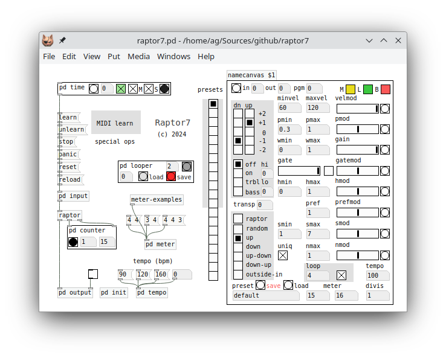

# Raptor: The Random Arpeggiator

Albert Gräf [\<aggraef@gmail.com\>](mailto:aggraef@gmail.com), March 2024  
Computer Music Dept., Institute of Art History and Musicology  
Johannes Gutenberg University (JGU) Mainz, Germany  
This document is licensed under [CC BY-SA 4.0](https://creativecommons.org/licenses/by-sa/4.0/).

In memory of Clarence Barlow (27 December 1945 – 29 June 2023).

## Introduction

This is version 7 of the Raptor patch, an experimental arpeggiator program based on the mathematical music theories of the composer and computer music pioneer Clarence Barlow. This version is a backport of the [Ardour plugin](https://github.com/agraef/ardour-lua) included in [Ardour version 8](https://ardour.org/news/8.1.html) and later, which in turn was based on the original Lua version of Raptor (version 6). The present version is compatible with the Ardour plugin in terms of the underlying arpeggiator core (written in Lua), as well as the parameters and factory presets. While it is ultimately based on [Raptor 6](https://github.com/agraef/ardour-lua), the patch was completely rewritten to provide an improved and simplified interface, and also offers some important new features, such as latch mode, improved transport and looper subpatches, and a built-in MIDI learn facility. Here's Raptor running in [Purr Data][]:

Raptor is quite advanced as arpeggiators go, it's really a full-blown algorithmic composition tool, although it offers the usual run-of-the-mill deterministic and random arpeggios as well. But the real magic starts when you turn on `raptor` mode and start playing around with the parameters in the panel. The algorithm behind Raptor is briefly sketched out in my [ICMC 2006 paper][] (cf. Section 8), and you'll find some practical information to get you started below. But if you'd like to get a deeper understanding of how the algorithm actually works, you'll have to dive into the source code and read Barlow's article in the [Ratio book][].

Using the patch is easy enough, however. Basically, you open raptor7.pd in Pd, hook up your MIDI keyboard and synthesizer to Pd's MIDI input and output, respectively, choose a preset, press the green play toggle in the time subpatch, and start playing chords. Note that Raptor only generates MIDI data, so you need some sound-generating device to make music with it. But it works just fine with a free software synth such as [Qsynth][]. Of course, Raptor can also be used with a DAW or outboard gear such as a hardware synth or a groovebox, and can be synced to those by sending MIDI clocks to its MIDI input. We discuss all this in more detail in the following sections.

## Getting Started

Raptor will run in any modern flavor of Pd. It has been tested with Miller Puckette's "vanilla" [Pd][], Jonathan Wilkes' [Purr Data][], and Timothy Schoen's [plugdata][]. The only additional requirement is that you'll need [pd-lua][] to run it. Both Purr Data and plugdata come with a recent version of pd-lua included and enabled by default. For vanilla, you can get pd-lua from [Deken][], and you then still need to add `pdlua` to your startup libraries.

There is no real installation process, just download the latest Raptor release or the current git source from [GitHub](https://github.com/agraef/raptor7) and unpack it. If Pd has been set up properly, double-clicking the raptor7.pd file (or running something like `pd raptor7.pd` from the command line on Linux) should open the patch in Pd. If that gives you a bunch of error messages in the Pd console window, then you probably still need to install pd-lua and enable it in your startup libraries, see above.

The raptor7.pd patch can be invoked by itself, or as a subpatch in another patch. In the latter case, you can also specify the name of an "autostart" preset to be recalled on startup as an argument (see the raptors.pd "ensemble" patch included in the distribution for an example).

The panel on the right-hand side of the main patch has quite a few controls to change meter, tempo, and the parameters of the algorithm. The current state of the parameters is stored in a preset on disk if you hit the `save` button (after typing its name in the symbol box at the bottom of the panel), so that you can recall it later with the `load` button. Or you can use the "quick dial" (the strip of radio buttons to the left of the panel) to choose any of the 12 factory presets and the first 8 user-defined presets with a click.

## The Arpeggiator

Raptor is really an algorithmic composition program driven by note input. It keeps track of the chords you play like any arpeggiator, but the note output it generates is in general much more varied than just playing back the input notes in a given pattern. This functionality is available with the `raptor` control. If it is disabled, Raptor will still apply some basic parameters to the velocities and note filters, and produce a traditional arpeggio from the notes you play. If it is enabled, however, Raptor will pick notes more or less at random from a set of *candidate notes* determined by various harmonic criteria. Depending on the parameter settings, the generated notes may be close to the input, or at least harmonically related, or they may be entirely different, so the output can change from tonal to atonal and even anti-tonal in a continuous way. Moreover, Raptor can also vary the tonal strength automatically for each step based on the corresponding pulse weights.

Raptor's note generation process is quite involved, but at the heart of it there are just two basic "[musiquantical](http://clarlow.org/wp-content/uploads/2016/10/On-MusiquanticsA4.pdf)" notions and corresponding measures from Barlow's theories: *meter* (which determines a kind of one-to-one pulse weights called *indispensabilities*) and *harmonicity* (a measure for the consonance of intervals calculated from so-called *indigestibilities*). In fact, there are a lot of similarities between Raptor and Barlow's famous [Autobusk][] program which is based on the same concepts. Both programs can operate in real-time, but Autobusk is driven exclusively by parameter input and will happily produce a constant stream of notes as soon as you turn it on. In contrast, Raptor never becomes "creative" on its own, it *always* requires note input, otherwise it will just sit there twiddling its thumbs.

Thus, in Raptor harmonicities are used to *filter* candidate notes in relation to its note input (the notes you play). In other words, they determine *what* to play. On the other hand, the pulse weights are used to *assign* various parameters to each step in the pattern, such as note velocities and probabilities, and gate values. That is, they determine *how* to play the notes picked by the filter. The arpeggiator orchestrates the entire process, by taking note input from the musician, feeding the required data to the various parts of the algorithm in each step, and playing back the resulting stream of notes.

One rather unusual feature of Raptor's algorithm is the way that the Barlow indispensabilities drive the entire process by modulating various other parameters. Like in Autobusk, the pulse strengths affect note velocity and probability, but in Raptor they also modulate harmonicity and thereby change the note selection process itself. Another unique feature of the algorithm is the harmonic preference parameter, which lets you prioritize notes by harmonicity, and can also be modulated by pulse strength in an automatic fashion.

In the following we give an overview of the available controls. Raptor includes various factory presets for illustration purposes which you can use as a starting point for your own presets. (NOTE: As distributed, the program numbers in the factory presets assume a synthesizer with a General MIDI sound bank. If you frequently use non-GM synths then you may have to change these.)

Ranges are given in parentheses. Switches are denoted 0/1 (off/on). Continuous values use the 0 - 1 or -1 - +1 range and can be arbitrary floating point values. These generally denote probabilities or other normalized values (such as indispensabilities, harmonicities, and modulation values) expressed as fractions; some of these (in particular, the modulation parameters) can also be negative to reverse polarity. Other ranges denote integer values, such as MIDI channel and program numbers, MIDI note offsets, or enumerations such as the pattern and pitch tracker modes.

### MIDI Controls

These controls let you change the MIDI program and the MIDI channels for input and output.

- pgm (0-128): Sets the MIDI program (instrument sound) of a connected synthesizer. pgm = 0 (the default) means no change, otherwise a MIDI program change message is sent to the output channel.
- inchan, outchan (0-16): Sets the MIDI input and output channels. inchan = 0 (omni) means that notes on all channels will be received, otherwise MIDI input on all other channels will be ignored. outchan = 0 means that output goes to the input channel; otherwise it goes to the given MIDI channel. The default is inchan = outchan = 0, which means that MIDI input will be received on all channels and output goes to the last channel on which input was received.

### Arpeggiator Modes

These controls are 0/1 switches which control various global modes of the arpeggiator.

- bypass (0/1):  This mode, when engaged, suspends the arpeggiator and passes through its input as is. This provides a means to monitor the input to the arpeggiator, but can also be used as a tool for live performance.
- latch (0/1):  In latch mode, the arpeggiator keeps playing if you release the keys on your MIDI keyboard. This is there to help imprecise players (like me) who tend to miss beats in chord changes, and makes playing the arpeggiator much easier.
- mute (0/1):  This control suppresses note output of the arpeggiator (the arpeggiator still keeps tracking input notes, so that it is ready to go immediately when you unmute it again).
- raptor (0/1): Toggles raptor mode, which enables the advanced raptor controls discussed below.
- loop (0/1), loopsize (0-16): This engages Raptor's built-in looper which repeats the last few bars of output from the arpeggiator. The loopsize control specifies the number of bars to loop. If input runs short then the looper will use what it has, but it needs at least one complete bar to commence loop playback. (Also check the Looper section below for more information.)

### Arpeggiator Controls

These controls are always in effect (unless the looper is active), no matter whether raptor mode is on or off. The modulation controls (velmod, gatemod, pmod) vary the corresponding parameters according to normalized pulse weights (i.e., indispensabilities) of the current step. These values can also be negative which reverses polarity. E.g., velmod = 1 means that the note velocity varies from minvel to maxvel, *increasing* with the pulse weight, whereas velmod = -1 varies the velocities from maxvel to minvel, *decreasing* with the weight. If velmod = 0, then the velocity remains constant at the maxvel value. The other modulation controls work in an analogous fashion.

- meter (1-16): This is a pair of numbers which specifies the desired time signature. The first value (the numerator) specifies the number of beats in a bar. The second number (the denominator) specifies the base pulse a.k.a. the unit of the beat. Thus, e.g., 4 4 denotes common time, a.k.a. 4/4. The base pulse can be further divided into tuplets with the division parameter, see below.
- division (1-7): Number of subdivisions of the base pulse. E.g., in a 4/4 meter a division value of 2 gives you duplets (eighth notes), 3 gives you (eighth) triplets, etc. The resulting number of steps you get is the numerator of the meter times the number of subdivisions. That's also the number that will be shown by the beat counter in the main patch.
- up, down (-2 - +2): Range of octaves up and down. Both values can also be negative. Typically, you'd use a positive (or zero) value for the up, and a negative (or zero) value for the down control. But you also might want to use positive or negative values for both, if you need to transpose the octave range up or down, respectively.
- mode (0-5): Sets the pattern mode. The collection is a bit idiosyncratic, but should nevertheless be familiar and cover most use cases: 0 = random, 1 = up, 2 = down, 3 = up-down, 4 = down-up, 5 = outside-in (alternate between low and high notes). Default is 1 = up.
- minvel, maxvel (0-127), velmod (-1 - +1): Sets minimum and maximum velocity. The actual velocity varies with the pulse weight, by an amount given by the velmod control.
- gain (0-1): This control ties in with the *velocity tracker*, a function which calculates a kind of envelope from the velocities of  the notes that you play and adjusts the velocities of output notes generated by the arpeggiator accordingly. The gain value actually controls the mix between preset velocity values (minvel, maxvel) and the calculated envelope, ranging from 0 (all envelope) to 1 (all preset; this is also the default).
- gate (0-1), gatemod (-1 - +1): Sets the gate (length of each note as a fraction of the pulse length). The actual gate value varies with the pulse weight, by an amount given by the gatemod control. Decreasing the gate value gives increasingly shorter staccato notes; a value of 1 means legato. A zero gate value (which wouldn't normally be terribly useful as it would indicate zero-length notes) is special. It *also* indicates legato and can thus be used just like a gate of 1, but also has a special meaning as "forced legato" in conjunction with the pulse filter (wmin, wmax), see below.
- wmin, wmax (0-1): Deterministic pulse filter; pulses with a weight outside the given wmin - wmax range will be filtered out. Raising wmin gradually thins out the note sequence while retaining the more salient steps. Lowering wmax produces an off-beat kind of rhythm. In particular, the pulse filter gives you a way to create a triplet feel without a swing control (e.g., in 4/4 try a triplet division along with a wmin value of 0.3). Note that by default, the pulse filter will produce a rest for each skipped step, but you can also set the gate control (see above) to 0 to force each note to extend across the skipped steps instead.
- pmin, pmax (0-1), pmod (-1 - +1): Probabilistic pulse filter. The given minimum and maximum probability values along with the corresponding modulation determine through a random choice whether a pulse produces any notes. You can disable this by setting pmax = 1 and pmod = 0 (which are the defaults).

### Raptor Controls

These controls only affect the arpeggiator if it runs in raptor mode. The modulation controls (hmod, prefmod, smod, nmod) work as described above to vary the corresponding parameter with the pulse weight of the current step. Raptor filters and orders candidate output notes according to various criteria, which determines which notes are eventually output by the arpeggiator in each step.

- hmin, hmax (0-1), hmod (-1 - +1): This filters candidate notes by comparing their (modulated) average harmonicity with respect to the input chord to the given bounds hmin and hmax. The harmonicity function being used here is a variation of the one in Barlow's Autobusk program, please see my [ICMC 2006 paper][], Section 8, for details. Some interesting harmonicity thresholds are at about 0.21 (the 5th), 0.17  (the 4th), 0.1 (major 2nd and 3rd), and 0.09 (minor 7th and 3rd). To hear the effect, try varying the hmin value while playing a single note.
- pref (-1 - +1), prefmod (-1 - +1): This parameter doesn't affect the candidate notes, but sorts them according to harmonic preference. The arpeggiator will prefer notes with high harmonicity if the value is positive, notes with low harmonicity if it is negative, and simply choose notes at random if it is zero. The preference also varies according to the prefmod modulation control with the current pulse weight. Basically, a high pref value tends towards a tonal, a low one towards an anti-tonal, and zero towards an atonal style, but of course this also depends on the hamonicity range set with the hmin and hmax parameters. This parameter can be very effective if the arpeggiator has enough candidate notes to choose from. E.g., pref = 1 with hmax = 1 will give you a high degree of tonality even if hmin is very low.
- smin, smax (-12 - +12), smod (-1 - +1): Determines the minimum and maximum step size in semitones between consecutive steps. Note that these values can also be negative, allowing for down-steps in an "up" pattern, and the step size can be modulated according to pulse weight. Since Raptor picks notes more or less at random, these parameters give you some control over how large the steps can be. You can also effectively disable this (set smin = 0 and smax = 12), but in this case make sure to also enable uniq mode (see below), otherwise the arpeggiator may just play the same note over and over again.
- nmax (0-10), nmod (-1 - +1): Sets the maximum number of simultaneous notes (modulated according to pulse weight). Thus Raptor can play more than one note at a time, but this only works in raptor mode.
- uniq (0/1): When set to 1, makes sure that notes are not repeated between consecutive steps.
- pitchhi, pitchlo (-36 - +36), pitchtracker (0-3): Set this to extend the octave range (up/down) by the given number of semitones. This gives you finer control over the range of candidate notes in raptor mode. Also, using the pitchtracker control, you can have the arpeggiator follow the (highest and lowest) notes you play and automatically adjust the range of candidate notes accordingly, taking into account the up/down and pitchhi/pitchlo settings. The pitch tracker can be run in four different modes, 0 = off, 1 = on (follow both high and low notes), 2 = treble (only follow the high notes), 3 = bass (only follow the low notes).

## Using Raptor

Basic usage is quite simple. For starters, you might want to pick one of the presets and go from there. Choose your desired tempo, meter, and subdivision (there are a few clickable examples in the main patch, and a lot more in the meter-examples subpatch).

Then start playback with the green play toggle in the time subpatch. Start playing chords and you should hear the generated notes sound on the connected synthesizer. Engage latch mode if needed. If you have a nice pattern going, engage the looper, fire up another Raptor instance and play along. E.g., try the tr808 preset (preset #10 on the quick dial) to get a simple drum pattern going.

If you have a MIDI controller or groovebox with a built-in chord generator and/or sequencer, then you might want to employ that device to provide input to the arpeggiator, so that you have your hands free to twiddle the controls in the panel. See the discussion of MIDI clock sync below in order to sync Raptor with the device.

### Transport

The easiest way to get transport rolling is with the green play toggle in the time subpatch. Alternatively, you can also click on the `Raptor7` logo in the main patch to toggle playback. Playback usually starts at the beginning of a bar, but you can also set an *anacrusis* (an *upbeat*, or *pickup* in American English) if you enter the pulse offset (counting from zero) into the little numbox in the time subpatch. This value can also be negative, to indicate a position relative to the *end* of a bar (e.g., -1 tells Raptor to start on the *last* beat of a bar).

In fact, the anacrusis can also be used as a position control while transport is rolling, which gives a kind of scrubbing effect (this works best if a loop is running). Also, there's a button (bang control) left to the numbox which rewinds to the position of the anacrusis. This won't have a noticeable effect unless transport is already rolling, in which case pressing the button repeatedly produces a kind of stuttering effect (again, this works best if a loop is running).

Once transport is rolling, the time subpatch indicates the beats by flashing the pulse indicator (bang control) on the right. You can also click that control to manually trigger the next pulse. This is useful, e.g., to listen to the generated notes in "slow motion" (with transport turned off). You can also trigger extra pulses at any time while transport is rolling.

The transport controls can all be mapped to MIDI commands, using the MIDI Learn facility discussed below, which makes them usable in a live performance.

### Time and Sync

The frequency at which pulses are being triggered depends on the meter (including division) and, of course, the tempo. One important thing to note here is that by convention, the tempo is *always* specified in *quarter* beats per minute, no matter what the actual base pulse of the meter is. This means that you can switch meters on a whim without having to constantly adjust the tempo when changing the base pulse.

E.g., at a tempo of 120 bpm, quarters run at 500 ms per step, 8ths at double speed (250 ms/step), 16ths at quadruple speed (125 ms/step), etc., no matter what the actual denominator of the meter may be. Raptor also allows you to use non-standard base units such as 6 (= quarter triplets), 12 (= 8th triplets), or even more exotic values such as 10 (= 8th quintuplets) which run at 333 ms, 166 ms, and 200 ms per step at 120 bpm, respectively. This makes it quite easy (or at least possible) to deal with really complex time signatures. However, if you just need tuplets, an easier and more traditional way to get these is to choose a "straight" base meter and adjust the division parameter instead.

If you have multiple Raptor instances playing in concert, they will be all synced up, with one instance (usually the one where playback was started) playing the role of a time master. This is indicated with the `M` toggle. Normally you don't need to mess with that toggle, it will be engaged automatically when you press the play button in an instance.

The time subpatch also has built-in MIDI sync support, which is enabled by default (you can configure this with the `S` toggle in the time subpatch). If you have software or hardware that can act as a MIDI clock source (most DAWs, sequencers, and grooveboxes have that functionality), you can just hook up the MIDI device which outputs the clocks to Pd's MIDI input. Once transport starts rolling on the device, Raptor will play along with it and the two should stay in sync. In this case the playback toggle in the time subpatch is without function, as the external time source drives playback.

### The Looper

You can toggle the loop control at any time and it will switch between loop playback and arpeggiator output immediately. This comes in handy if you want to play along, or need to get your hands free to record a generated pattern.

To the left of the panel, you'll find the looper subpatch, a little applet which lets you save the currently playing loop to a file, and reload it later. It also counts off the bars in a loop, so that you can always tell where you are in the loop.

Loops are stored in the data subdirectory, under the name of the current preset, so they will usually be associated with a given preset name. However, that name prefix doesn't necessarily have to exist as an actual preset; the looper will happily use any name prefix that you type into the preset name field at the bottom of the panel. You can also switch presets while a loop is playing and store the same loop under different preset names.

For each preset there are 100 slots (numbered 0-99) under which a loop can be saved. The slot can be selected with the numbox on the left. If a slot already has a loop in it, the load button will turn gray to indicate that there's a loop that can be loaded there. Similarly, the save button will turn red to warn you that pressing the button would overwrite an existing loop in that slot. (If you still overwrite a loop file by accident, no worries, Raptor will have saved a backup copy, so that you can recover the loop if needed.)

The loop files themselves are just Lua tables, so you can also edit them in any text editor if needed, as long as you keep the Lua table syntax intact. Besides the actual note data, Raptor also records meter (including division) and tempo information in the loop file (you can find these at the end of the table). The meter and tempo will be restored when a loop file is loaded.

### MIDI Learn

Raptor has a lot of parameters which you might want to work with during live performances. Fortunately, it's possible to map most of these using the built-in MIDI learn facility. You can assign MIDI control changes and note messages to any of the controls in the panel, as well as some of the controls in the time subpatch, as follows:

- Click the `learn` message in the main patch. The background of the "MIDI Learn" label in the main patch will turn a light green to indicate that you're in MIDI mapping mode.
- Click or move the control on the MIDI device. This can be any knob, fader, or button, but only controls generating MIDI CC or note messages are supported at this time.
- Click or wiggle the control in the time patch or panel that you want to bind the MIDI message to.

You can also first operate the control in the patch and then the MIDI control, if you prefer. And you can abort the process at any time by clicking `learn` again. It's also possible to delete an existing binding by clicking `unlearn` after choosing the MIDI or Raptor control. Raptor will provide feedback and guide you through the process with some messages in the Pd console. In particular, it will tell you if there is an existing binding for the same MIDI control or parameter value, so that you can get rid of it if needed.

The learned MIDI binding will be in effect immediately, in *all* running Raptor instances. It will also be stored in the midi.map file in the data directory, from where all bindings will be reloaded next time you fire up Raptor. Note that while it's possible to map different MIDI controls to the same Raptor parameter, at present you can't have a MIDI control affect multiple parameters at once (no macro controls, sorry!).

Also note that if you're running multiple Raptor instances, normally MIDI controls will affect them all, so their parameters will change in lockstep. If you want to operate a single Raptor instance instead, you can click the unlabeled button in the top left corner of the panel. The button will turn blue to indicate that only this instance is now receiving the control data. You can switch instances at any time, and clicking the blue button again will return the Raptor controls to omni mode, in which all instances receive the control data.

#### Novation Launch Control XL Support

The [Novation Launch Control XL][] is a popular mixer-style controller with lots of knobs and faders, which makes for a nice Raptor control surface, so Raptor has special support for it. To make this work, you need to connect the Launch Control XL to Pd's *second* MIDI input port. This ensures that messages from the controller don't interfere with MIDI data from the primary input device on Pd's first MIDI input port, where you'd typically connect your MIDI keyboard, pad controller, etc.

The Launch Control XL support consists of two parts. First, there's a launchcontrol.map file in the data directory with ready-made MIDI bindings for the device. To use it, just copy that file to midi.map and you should be set. Check the comments at the beginning of the file for information on the bindings.

Second, Raptor includes some hard-wired MIDI bindings for the Launch Control which let you switch the target Raptor instance for MIDI control easily and quickly. To do this, press (and hold) the "Device Hold" button, while you push one of the "Device Select" (left/right) buttons to cycle through the Raptor instances, or the "Device Bank" buttons labeled 1-8 to directly change to the corresponding instance (or switch back to "omni" if the given instance was already selected).

Some additional looper controls are available as well. Press (and hold) the "Device Hold" button, while you click the up and down buttons to select a loop in the looper subpatch, or the "Mute", "Solo", and "Record Arm" buttons to load and save a loop, and toggle the loop control in the panel, respectively.

#### AKAI Professional MIDIMIX Support

The [AKAI MIDIMIX][] is another popular (and more budget-friendly) controller which has a very similar layout to the Launch Control XL. Raptor includes support for this device as well, consisting of a MIDI mapping and some hard-wired bindings for the looper and for switching Raptor instances.

Note that this mapping is a bit quirky because the MIDIMIX has less buttons. In particular, it lacks a dedicated device select button, so the SOLO button is used as a kind of shift button for selecting Raptor instances instead. A description of the mapping can be found in the midimix.map file in the data directory. To use this mapping, copy the file to midi.map and make sure that the MIDIMIX is connected to Pd's second MIDI input.

## Quirks and Limitations

Here are some known issues and how to work around them. Anything else that seems to be missing or not working properly? File a [bug report][], or (better yet) submit a [pull request][]!

### Time Sync

While MIDI sync should just work out of the box if your DAW can spit out a coherent stream of MIDI clocks, pulses may occasionally appear to be "shifted" (out of phase) if the meter settings don't match up, or if your DAW lacks support for song position pointer (SPP) messages and you start playback in the middle of a bar.

There's not really much that can be done about this on the Raptor side, as the limitations are in the protocol (or due to bugs in the DAW). We might add more comprehensive protocols such as MTC, MMC, or [Ableton Link][] some time. But MIDI clocks are so much simpler and they work with pretty much any music application and recording gear, so they will do for now. Just make sure that you have Raptor's meter (and anacrusis) set correctly, then you should be fine.

### Looper Features

Raptor's looper is (by design) quite basic. Its main purpose is to give you a simple way of putting a generated musical phrase on repeat while you have your hands free for soloing, diffusion (knob-twiddling), or capturing that precious pattern before it vanishes forever. Moreover, those .loop files are just Lua tables, so they can easily be edited in a text editor or processed in Lua. If you need more features, then I'd recommend running Raptor alongside a DAW tailored to live usage, such as Ableton Live or Bitwig Studio, or even just a standard DAW like Ardour or Reaper. In particular, this gives you the ability to also record the *input* to the arpeggiator, which makes it much easier to tweak the results later.

Overdubbing and more advanced loop editing capabilities would be nice to have; but then again, if you want Ableton Live, you know where to get it. Other limitations in the current implementation are that at most 256 steps can be recorded, and loops are always quantized to whole bars. The former hopefully isn't a big deal in practice and can easily be changed in the source if needed, and the latter can always be solved by recording directly into a DAW instead.

### MIDI Learn

In a similar vein, Raptor's MIDI learn facility is also fairly basic. It's only possible to map MIDI CC and note messages at present; having support for other kinds of messages such as aftertouch could be useful; we might add this in a future update. Also, there's no support for macro controls. That's unlikely to change in the near future, as it would require a lot of additional machinery in order to adjust the value mapping.

At present, special support is only available for the Launch Control XL. There are other popular (and more budget-friendly) controllers. Thus, if anyone can contribute MIDI maps or special support for other devices, please submit a [pull request][]!

[ICMC 2006 paper]: https://github.com/agraef/raptor7/blob/main/scale.pdf
[Ratio book]: http://clarlow.org/wp-content/uploads/2016/10/THE-RATIO-BOOK.pdf
[Autobusk]: http://www.musikinformatik.uni-mainz.de/Autobusk/
[Purr Data]: https://agraef.github.io/purr-data/
[Pd]: http://msp.ucsd.edu/software.html
[plugdata]: https://plugdata.org/
[pd-lua]: https://agraef.github.io/pd-lua/
[Deken]: https://github.com/pure-data/deken
[Qsynth]: https://qsynth.sourceforge.io/
[Novation Launch Control XL]: https://novationmusic.com/products/launch-control-xl
[AKAI MIDIMIX]: https://www.akaipro.com/midimix
[Ableton Link]: https://www.ableton.com/link/
[bug report]: https://github.com/agraef/raptor7/issues
[pull request]: https://github.com/agraef/raptor7/pulls

